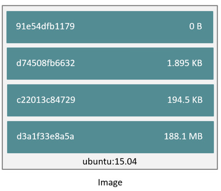
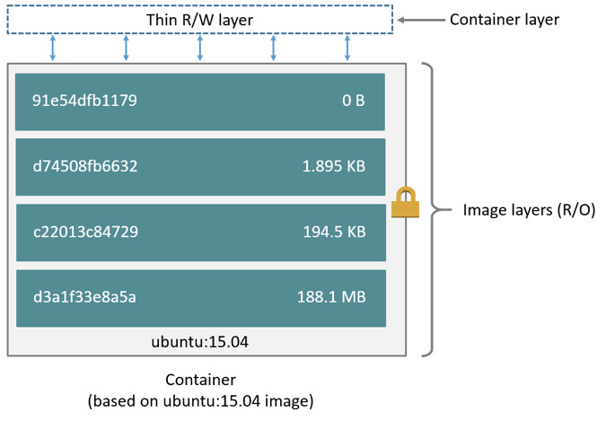

# Lab 01 : Introduction to Docker

> **Difficulty**: Easy

> **Time**: 20 minutes

> **Tasks**:
>- [Prerequisites](#prerequisites)
- [Task 1: Verify your environment](#task-1-verify-your-environment)
- [Task 2: Learn about images](#task-2-learn-about-images)
- [Task 3: Building Images from Dockerfile](#task-3-building-images-from-dockerfile)
- [Task 4: Running Containers](#task-4-running-containers)
- [Task 5: Maintaining Containers](#task-5-maintaining-containers)
- [Task 6: Share your image with Docker Hub](#task-6-share-your-image-with-docker-hub)

## What is Docker?

Docker is an open platform for building, shipping and running distributed
applications. It gives programmers, development teams and operations engineers
the common toolbox they need to take advantage of the distributed and networked
nature of modern applications. This tutorial uses some simple tasks to
introduce you to Docker concepts and operations.

The Docker platform is composed of several products. To use Docker to build
images and share them with others, at minimum, you need Docker Engine and Docker
Hub.

### Docker Engine

Docker Engine is responsible for building images and running containers. The
Engine consists of a command-line (CLI) client and a server (daemon) process.
When you install Docker Engine on your machine, both the server and the
command-line client are installed.

The server run as a daemon process on your machine. It manages images and
containers on your system. The command-line client is used to instruct the
daemon in this management.

Docker is built using a client-server architecture. Behind the scenes, the CLI
wraps a well-defined remote API. Any commands executed by the client get translated
to API calls that are made to the daemon. You can use this same API to communicate
with the daemon using standard API calls over HTTP/HTTPS.

### Docker Hub

Docker Hub is a cloud-based registry service for building, storing, and shipping application or service images.
It provides a graphical user interface and allows you to store your images
privately or make them publicly available to other Docker users. Underlying the
Docker Hub is Docker's Registry technology. This registry is an image repository
available to the public.

To use Docker Hub, you simply create an account. Once you have an account, you
can use the Engine CLI client to log into and push your images to the Hub.

You can build a private Docker Registry which gives you core image management
without a graphical user interface or other features of the Hub. Or, you can
purchase our enterprise-grade Docker Trusted Registry which provides
feature-rich graphical tools in addition to the Docker Registry technology.

## Prerequisite

Make sure you have already [created a Docker Hub account](0-setup.md) before beginning this lab. You will be using `node-0` for this lab.

## Task 1: Verify your environment

Docker Engine should be installed and running in your machine. To verify that Docker is running, do the following:

1. Log in as 'ubuntu' into the AWS instance **node-0** you were given at registration.

2. Check you are running the latest version of Docker.

        $ docker version
        Client:
         Version:      1.9.0-rc4
         API version:  1.21
         Go version:   go1.4.2
         Git commit:   e6f5a3c
         Built:        Sat Oct 31 05:32:00 UTC 2015
         OS/Arch:      linux/amd64

        Server:
         Version:      1.9.0-rc4
         API version:  1.21
         Go version:   go1.4.2
         Git commit:   e6f5a3c
         Built:        Sat Oct 31 05:32:00 UTC 2015
         OS/Arch:      linux/amd64

   If Docker is running properly, you should see both `Client` and `Server`
   version details. In this step, you issued a CLI command which communicated
   over the local Unix socket on which the daemon is listening. This socket is
   `/var/run/docker.sock` by default and is owned by `root`.

3. Try running a simple `hello-world` container.

        $ docker run hello-world
        Unable to find image 'hello-world:latest' locally
        latest: Pulling from library/hello-world
        b901d36b6f2f: Pull complete
        0a6ba66e537a: Pull complete
        Digest: sha256:517f03be3f8169d84711c9ffb2b3235a4d27c1eb4ad147f6248c8040adb93113
        Status: Downloaded newer image for hello-world:latest

        Hello from Docker.
        This message shows that your installation appears to be working correctly.

        To generate this message, Docker took the following steps:
         1. The Docker client contacted the Docker daemon.
         2. The Docker daemon pulled the "hello-world" image from the Docker Hub.
         3. The Docker daemon created a new container from that image which runs the
            executable that produces the output you are currently reading.
         4. The Docker daemon streamed that output to the Docker client, which sent it
            to your terminal.

        To try something more ambitious, you can run an Ubuntu container with:
         $ docker run -it ubuntu bash

        Share images, automate workflows, and more with a free Docker Hub account:
         https://hub.docker.com

        For more examples and ideas, visit:
         https://docs.docker.com/userguide/

     This command ran the `hello-world` image in a container. After the image completes running, the container exits.

 Try to issue the following commands and observe the output:

 - `docker info` Provides information on Docker Engine settings. This includes information such as:
    * number of running containers
    * number of cached images
    * storage backend
    * operating system
    * root directory
 - `docker ps` Lists currently running containers. You should see none as there are none currently running.
 - `docker images` Lists all available images. You should see at least one, the `hello-world` image.

## Task 2: Learn about images

Docker images are a series of read-only layers that are stacked on top of each
other to form a single unified view. The first image in the stack is called a
*base image* and all the other layers are stacked on top of this layer. The
diagram below shows the Ubuntu 15:04 image comprising 4 stacked image layers.

When you make a change inside a container by, for example, adding a new file to
the Ubuntu 15.04 image, you add a new layer on top of the underlying image
stack. This change creates a new image layer containing the newly added file.
Each image layer has its own universal unique identifier (UUID) and each
successive image layer builds on top of the image layer below it.

Containers (in the storage context) are a combination of a Docker image with a
thin writable layer added to the top known as the *container layer*.  The
diagram below shows a container running the Ubuntu 15.04 image.

The major difference between a container and an image is this writable layer.
All writes to the container that add new or modifying existing data are stored
in this writable layer. When the container is deleted the writable layer is
also deleted. The image remains unchanged.

You can run containers from images that you built or that you pulled from the
Docker Hub. Docker Hub has millions of images that are created and shared by
regular users. Additionally, Docker Hub hosts official images ( e.g
Ubuntu, Redis, and Mongo) that are created and maintained by their respective
companies.

Issue the following commands and observe the output:

1. Search Docker Hub for all images that include the word "ubuntu" in them.

        $ docker search ubuntu

  When you execute this command you search Docker Hub for all images that contain the word 'ubuntu' in them. You can search Docker Hub from the web if you go to [www.hub.docker.com](https://hub.docker.com/explore/).

  You'll notice that the search results include an `OFFICIAL` column. Official images are certified by Docker to indicate that they are built using certain standards. You'll find a list of official images here : https://github.com/docker-library/official-images/tree/master/library.

2. Pull the `ubuntu` image.

        $ docker pull ubuntu:latest
        latest: Pulling from library/ubuntu

        c63fb41c2213: Pull complete
        99fcaefe76ef: Pull complete
        5a4526e952f0: Pull complete
        1d073211c498: Pull complete
        Digest: sha256:8b1bffa54d8a58395bae61ec32f1a70fc82a939e4a7179e6227eb79e4c3c56f6
        Status: Downloaded newer image for ubuntu:latest

  You requested to pull the official ubuntu image. The word 'latest' is a tag used to identify the specific version of the image to pull. If the image name and tag are found in Hub, each layer of the image is downloaded and cached locally.

3. Verify which images you have downloaded

        $ docker images
        REPOSITORY          TAG                 IMAGE ID            CREATED              VIRTUAL SIZE
        ubuntu              latest              1d073211c498        10 days ago          187.9 MB
        hello-world         latest              0a6ba66e537a        2 weeks ago          960 B

## Task 3: Building Images from Dockerfile

There are two ways to create Docker images. You can use the CLI to  update a
container created from an image and commit the results to a new image.
Alternatively, you can write a Dockerfile which contains instructions to create
an image. Then, use the CLI to build an image from the Dockerfile.

Using the command line to update an image makes it harder to track all changes that made to the new image once they're complete. The most common way used to create new images is through the Dockerfile.

A Dockerfile is a text file that contains all the commands, in order, needed to build a given image. A primary advantage of Dockerfile is version control and documentation. A Dockerfile details all the steps used to create a particular image. Dockerfiles adhere to a specific format and require a specific instruction syntax. Some common commands used in Dockerfile are `FROM`, `RUN`, `WORKDIR`, `EXPOSE`, and `CMD`. Docker maintains [a complete syntax guide to Dockerfiles](https://docs.docker.com/articles/dockerfile_best-practices/).

In the following task, you will be building a new image from a Dockerfile. You'll start from \the `ubuntu:latest` image that you just pulled as a base image.

1. Create an empty directory on the local file system.

        $ mkdir task3

  When you build a and image, it uses the directory as **build context**. So, best to start with an empty one.

2. Change into your empty directory.

        $ cd task3

2. Create a new file named `Dockerfile` in this directory.

3. Edit the `Dockerfile` using your favorite text editor.

  The `vim`, `vi`, and `nano` editors are all available on Ubuntu.

4. Add the following to the file:

        FROM ubuntu:latest
        RUN apt-get update && apt-get install -y tree
        RUN mkdir /mydir
        ENV HOSTNAME mycontainer
        WORKDIR  /mydir
        CMD ["/bin/bash"]

  * `FROM ubuntu:latest` This image is based on ubuntu:latest
  * `RUN apt-get update && apt-get install -y tree`   Updates the package lists and installs **tree**
  * `RUN mkdir /mydir` Creates a directory called `mydir` under root directory
  * `ENV HOSTNAME mycontainer` -> creates an environment variable called `HOSTNAME` with a value set to 'mycontainer'
  * `WORKDIR  /mydir` Sets the `/mydir` directory as the working directory for the image.
  * `CMD ["/bin/bash"]` Starts `/bin/bash` when a container is created from this image.

5. Save and close the file.

6. Build your image using the **Dockerfile**.

        $ docker build -t myimage:v1 .

    Docker goes through the Dockerfile instructions one line at a time. Each line in creates an **intermediate** image by creating a container from the previous line, running the current command, and committing that container into a new image. The process is repeated until the last command is successfully committed into an image. The last image is the final product of the build process and, in this case is tagged as 'myimage:v1'.

7.  List your new image.

        $ docker images
        REPOSITORY          TAG                 IMAGE ID            CREATED              VIRTUAL SIZE
        myimage             v1                  3dc725993d1a        About a minute ago   289.8 MB
        ubuntu              latest              1d073211c498        10 days ago          187.9 MB
        hello-world         latest              0a6ba66e537a        2 weeks ago          960 B

## Task 4: Running Containers

In this task, you create and run a new container from the image built in the previous task.

1. Create a container by running the image.

        $ docker run -it myimage:v1
        root@mycontainer:/mydir#

  The '-it' flags connects you to the STDIN of the container's main process ( in
  this case, it was `/bin/bash`) using a pseudo tty connection that Docker
  creates. Notice that you're currently connected to the container with a
  hostname of 'mycontainer' and the current working directory is set to
  '/mydir'.  

3. Verify that 'tree' is installed.

          root@mycontainer:/mydir# which tree
          /usr/bin/tree

4. List the content of the root directory.

          root@mycontainer:/mydir# ls -la / | grep mydir
          drwxr-xr-x   2 root root 4096 Nov  2 04:55 mydir

  The container runs as long as PID 1 (in this case it is `/bin/bash`) is
  running. The moment you issue a `CTRL+C` to exit the container, the container is
  stopped.

5. Keep the container running and exit by pressing `CTRL + P + Q` at your keyboard.

  The container is still running.

6. Verify the container is still running.

        $ docker ps

  This shows the `CONTAINER ID`, `IMAGE`, creation time (`CREATED`), `STATUS`, any mapped `PORTS`, and container `NAMES` of running containers *only*. Unless you specify a name for the container when you create it with the '--name' flag, Docker assigns a random name to it.

7. Display all containers running and stopped.

        $ docker ps -a

## Task 5: Maintaining Containers

Docker provides events, stats, and logging APIs to help you maintain and troubleshoot your containers. The Stats API provide CPU and memory stats for your container. The Logs API provides all the logs produced by the STDOUT of the PID 1 process inside your container. The Events API shows all Docker Engine events.

1. Create an environment variable for the container ID.

        $ CID=$(docker ps -lq)

2. See the stats for the container.

        $ docker stats $CID

3. Press CTRL-C to exit the stats.

4. View the logs for the container.

        $ docker logs $CID

5. View the events.

        $ docker events --since 1h

6. Press CTRL-C to exit the logs.

## Task 6: Share your image with Docker Hub

Docker Hub is an online registry to store and share images. It is the default
registry that Docker Engine uses to look for images when you try to pull them.
If you haven't done so already, please create a free account with
[www.hub.docker.com](https://hub.docker.com/).

Once you  have an account, you can login. Login is required to push images to Hub. Login is not required to pull public images. You can create either public or private images on Hub.

1. From the command line, login into Hub with your credentials.

        $ docker login
        Username: <username>
        Password: <password>
        Email: <email@com>
        WARNING: login credentials saved in /home/ubuntu/.docker/config.json
        Login Succeeded

  If login is successful, you should see a note confirming that.

  To push an image to Docker Hub, you must tag it. The format to tag images that are distributed via Docker Hub is:

  `<Docker Hub Username>/<Image Name>:<Tag or Version>`

2. Tag your image

        $ docker tag myimage:v1 <YOUR_DOCKER_HUB_USERNAME>/myimage:v1

3. List your new image.

        $ docker images
        REPOSITORY          TAG                 IMAGE ID            CREATED             VIRTUAL SIZE
        myimage             v1                  3dc725993d1a        39 minutes ago      289.8 MB
        moxiegirl/myimage   v1                  3dc725993d1a        39 minutes ago      289.8 MB
        ubuntu              latest              1d073211c498        10 days ago         187.9 MB
        hello-world         latest              0a6ba66e537a        2 weeks ago         960 B

  Tagging an image doesn't duplicate it, it simply adds additional metadata and points at same image. You can confirm that by looking at the Image ID. Notice that the Image ID is the same for 2 out of the 3 images listed.

4. Push your image to Docker Hub.

        $ docker push <YOUR_DOCKER_HUB_USERNAME>/myimage:v1

5. Go to [hub.docker.com](https://hub.docker.com) after a successful push to see your new image.

  You can simply now pull that image from any other Docker Engine using: `docker pull <YOUR_DOCKER_HUB_USERNAME>/myimage:v1`

## Conclusion

Congratulations, You have successfully completed this lab! You learned how to work with Docker, build images, and use Docker Hub to share them!

### Share on Twitter!

<a href="http://ctt.ec/lcHg0" target=“_blank”>

## Cleanup

If you plan to do another lab, you need to cleanup your EC2 instances. Cleanup removes any environment variables, configuration changes, Docker images, and running containers. To do a clean up,

1. Log into each EC2 instance you used and run the following:

      $ source /home/ubuntu/cleanup.sh

## Related information

[Docker Docs ](https://docs.docker.com/engine/userguide/)
