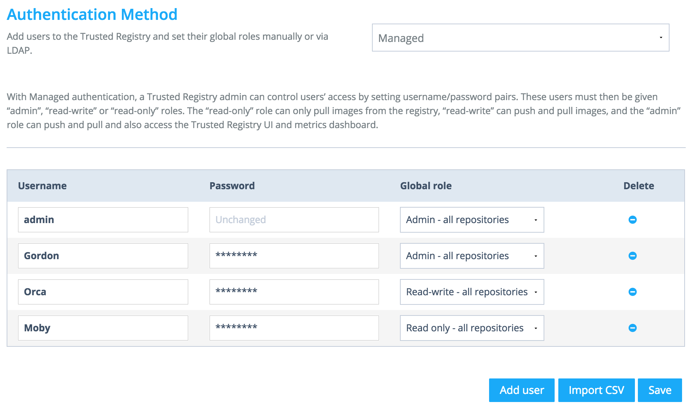
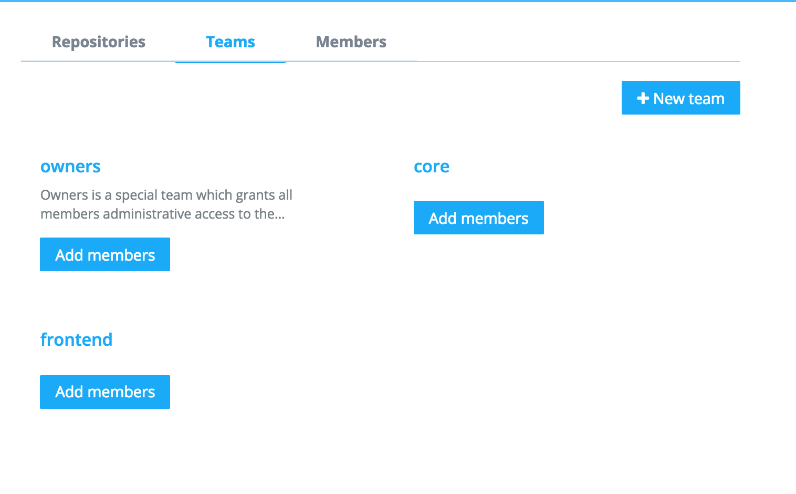
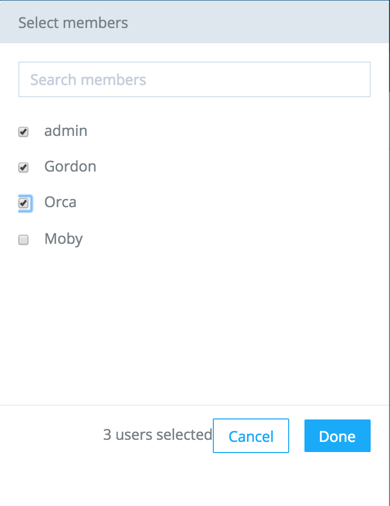
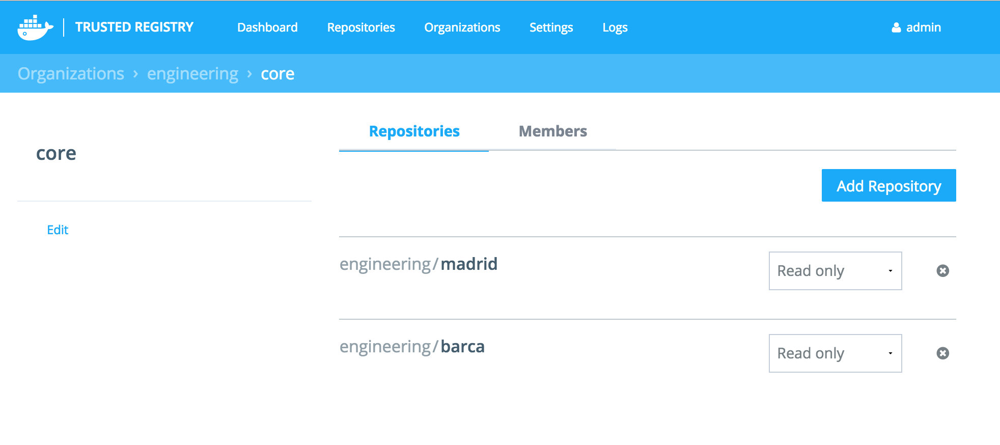

# Lab 03 : Docker Trusted Registry

> **Difficulty**: Intermediate

> **Time**: 30 minutes

> **Tasks**:
> 
- [Prerequisites](#prerequisites)
- [Task 1: Installing DTR](#task-1-install-dtr)
- [Task 2: Setting up DTR](#task-2-setting-up-dtr)
- [Task 3: Creating Organizations, Teams, Members,and Repositories](#task-3-creating-organizations-teams-membersand-repositories)
- [Task 4: Pushing and Pulling DTR Images](#task-4-pushing-and-pulling-dtr-images)
- [Task 5: Storage and Logs](#task-5-storage-and-logs)
- [Task 6: DTR API Console](#task-6-dtr-api-console)
- [Task 7: Deleting Images](#task-7-deleting-images)

# Getting Started with Docker Trusted Registry (DTR)

Docker Trusted Registry (DTR) is a secure, on-premises, commercially supported, enterprise-class image registry. It features an easy-to-use web admin portal, Active Directory/LDAP integration, cloud storage backends, image provenance, and highly secure authentication and authorization.

Docker released DTR 1.4 on November 12th, 2015. With version 1.4 you have new awesome features like:

* Repository Search
* Image Provenance (Integration with Docker Content Trust)
* Organizations, Teams, and Members
* Image Garbage Collection (Hard Image Deletes)
* Image Deletion from Index (Soft Image Deletes)
* API Console + Documentation
* Support for new storage backends (OpenStack Swift)

## Prerequisites

* You will use two nodes: **node-0** and **node-1**
* Ensure that no containers are running on these containers.
* Ensure that Docker engine uses default daemon options - `DOCKER_OPTS` should be commented out in `/etc/default/docker`
* Ensure that DOCKER_HOST is unset - `$unset DOCKER_HOST`
* Certain TCP ports are only allowed on the private AWS network. Therefore, you will need to use the private network (10.X.X.X) when you substitute the IP of the instance in certain commands/configuration files throughout this lab.

## Task 1: Installing DTR

Install DTR on **node-0** with the following command:


    $ sudo bash -c "$(sudo docker run docker/trusted-registry install)"

This step will automatically download and run the required containers that comprise the Docker Trusted Registry service. It might take a couple of minutes to complete. 

Once complete, check if all DTR containers are up using the `docker ps` command. Output will look like the following (there are several containers comprising the DTR service)

	$  docker ps
		CONTAINER ID        IMAGE                                          COMMAND                  CREATED             STATUS              PORTS                                      NAMES
		4494912febf8        docker/trusted-registry-nginx:1.4.2            "nginxWatcher"           12 hours ago        Up 12 hours         0.0.0.0:80->80/tcp, 0.0.0.0:443->443/tcp   docker_trusted_registry_load_balancer
		c9a66b28fbf9        docker/trusted-registry-admin-server:1.4.2     "server"                 12 hours ago        Up 12 hours         80/tcp                                     docker_trusted_registry_admin_server
		eaad8df99c25        docker/trusted-registry-log-aggregator:1.4.2   "log-aggregator"         12 hours ago        Up 12 hours                                                    docker_trusted_registry_log_aggregator
		682c014cf459        docker/trusted-registry-garant:1.4.2           "garant /config/garan"   12 hours ago        Up 12 hours                                                    docker_trusted_registry_auth_server
		21439e31e4b0        postgres:9.4.1                                 "/docker-entrypoint.s"   12 hours ago        Up 12 hours         5432/tcp                                   docker_trusted_registry_postgres
		6b029ece4740        docker/trusted-registry-index:1.4.2            "index"                  12 hours ago        Up 12 hours                                                    docker_trusted_registry_registry_index
		78cf25a17bf4        docker/trusted-registry-distribution:v2.2.1    "registry /config/sto"   12 hours ago        Up 12 hours         5000/tcp                                   docker_trusted_registry_image_storage_1
		840c3c2529ca        docker/trusted-registry-distribution:v2.2.1    "registry /config/sto"   12 hours ago        Up 12 hours         5000/tcp                                   docker_trusted_registry_image_storage_0


## Task 2: Setting up DTR

Although DTR is up and running, there are a few settings you need to configure:

- Authentication
- License
- Domain name

The following steps will walk you through configuring these settings. 

### Step 1: Authentication Settings

In this step you will configure DTR authentication. DTR supports the following authentication options: 

- **None**: disables authentication 
- **Managed**: uses a local user database (via the `postgres` container) 
- **LDAP**: allows you to integrate your own LDAP service with DTR. 

We will use the "Managed" authentication option in this tutorial.

1. Browse to the URL of your **Node 0** over HTTPS

	The URL of your **node-0** is the DNS name of your **node-0** AWS isntance and is provided to you as part of this lab. It will look something like `https://ec2-52-91-195-21.compute-1.amazonaws.com`

2. Proceed insecurely when you get a certificate warning
3. On the DTR landing page click the `X` on each of the red/orange information messages in the bottom right of the page 
4. Click `Settings` > `Auth` and select `Managed Authentication` from the dropdown
5. Create a new user:
	* Click on the `Add user` button
	* Enter a username and password
	* Select `Admin - all repositories` from the **Global role** dropdown
	* Click `Save`
	
	
6. The page will be reloaded and you will be prompted to login. Use the username/password that you just created.

### Step 2: Upload License

If you already have a DTR license, you can use it for this lab. If not, you can obtain a **Free 30-day Trial license** [here](https://hub.docker.com/enterprise/trial/).

Once you have your license, follow the procedure below:

1. Go to [Docker Hub](https://hub.docker.com/account/settings/) and sign in
2. Click your username in the top right corner and select `Settings`
3. On the resulting page select the `Licenses` tab
4. Click the download button shown in the image below


5. Go back to your DTR web page
6. Click `Settings` > `License` and click the `Chose file` button
7. Locate the license file you downloaded from Docker Hub
   
    The "License ID" field will not populate until you have completed the following step.
 
8. Click `Save and restart`

    You may have to manually refresh the page after this step. Once the page is refreshed the "License ID" field will be populated.

### Step 3: Configure Domain Name

Navigate to the `General` tab and enter **Node-0**'s public DNS name as in the "Domain name" field. Click `Save and Restart`.

>**Note:** The domain name is the public DNS name of your **node-0**'s AWS instance.


When the DTR server restarts you will get another authentication warning. This is because the DTR servers certificate has been updated with a new domain name. It is safe to continue past this warning.

## Task 3: Creating Organizations, Teams, Members, and Repositories

One of the newly added features of Docker Trusted Registry is the ability to create Organizations,Teams, and Members for easier management, increased security, and enhanced auditing. You now have the ability to group multiple members, with different privileges, into a team, and associate that team to an organization. Let's use the following scenario throughout this task:

**Scenario:** Our engineering organization is working on a new project based on two repositories `barca` and `madrid`. The project involves two teams: **Core** and **Frontend**. The Core team includes the users **gordon** and **orca**. The Frontend team includes the users **gordon, moby,** and **ahab**. You'd like to ensure that both teams can collaborate on this project with one restriction: **ahab** can only access the `madrid` repo.  


### Members and Roles

In the lab, we will create four users: **gordon, orca, moby** and **ahab**. Three will have **global roles** as follows:

- **moby**: Read-only - all repositories
- **orca**: Read-write - all repositories
- **gordon**: Admin - all repositories

The fourth member, **ahab**, does not have a **global role**. Non-global roles do **not** provide users with access to all the repositories in DTR. Instead, they can only access their personal repositories and repositories that belong to teams they are part of.

1. From the DTR Admin web page navigate to `Settings` >> `Auth` and add the users as shown below:

    

2. Click `Save`

### Organizations and Teams

Now let's create the "engineering" organization with two teams - "core" and "frontend".

1. Go to the `Organizations` tab and click `New organization` 
2. Name the organization "engineering" and click `Save`
3. Select the newly created "engineering" organization, and click on the `Teams` tab
4. click the `New team` button 
5. Name the new team "core"
6. Click `Add members`
7. Select "gordon" and "orca" from the list of all DTR users and click `Done`
8. Click `Create team`



Following the same procedure, create another team called "frontend" and add **gordon, moby and ahab**.




### Creating Repositories

Repositories can belong to an organization or a user:

- **Organization**: `<DTR Hostname>/<Organization Name>/<Repo Name>:<Tag>`
- **User**: `<DTR Hostname>/<User Name>/<Repo Name>:<Tag>`

Any user can create a personal repository by going to `Repositories` > `New Repository`. But only members of an organization owners team can create an organization repository. 

You can create a new organization repository by going to `Organizations` > `<Organization Name>`, or by going to `Repositories` > `New Repository` and selecting the desired organization namespace from the dropdown menu.

Users with Global roles have access to all repos - even repos that belong to organizations they do not belong to. The value of assigning repos to teams comes when you need non-global users to have access to team-level repos ONLY. In our case, this allows us to restrict **ahab** to the Frontend team's **madrid** repo.

The following procedure will create a repo for the **core** team, and another repo for the **frontend** team.

1. Click the `Organizations` tab and select the "engineering" organization`
2. Click `Teams` choose the "core" team
3. Click `Add repository` 
4. Create a **new** repository with the following settings: 
    - **Repository name**: barca 
    - **Permission**: Read-only
    - **Visibility**: Private
5. Click `Done`

    > **Note**: All members of an organization can access the **Private** repos of that organization. **Public** repos are exactly what they sound like; they can be pulled by **anyone** without any authentication (similar to Docker Hub public repos). The drop-down permission options indicate what non-global users are authorized to do with this repo. 

Using the same procedure as above, create a private repo **for the frontend team** with the following settings:

- **Repository name**: madrid
- **Permission**: Read-Write
- **Visibility**: Private 

This will create an organizational repo that **ahab** is able to both push and pull to. Once you are done you should see the following:



## Task 4: Pushing and Pulling DTR Images

In this task, we will push and pull images from the **barca** and **madrid** repos we created earlier. We will attempt these operations while logged in as different users.

The aim of this task is to see DTR permissions in action. Some of the pushes and pulls we perform will succeed, and some will fail. The success or failure of a push or pull operation will depend on the permissions and team memberships of each of our users.

In the lab we will use **node-1** to push and pull from our DTR instance which is running on **node-0**. In order for **node-1** to be able to push and pull to our DTR instance we need to configure it to trust our DTR instance.

### Configuring **node-1** to trust DTR

1. SSH to **node-1** 
2. Elevate your privileges 

		$ sudo su
 
3. Configure **node-1** to trust your DTR instance with the following sequence of commands

    > **Note**: Be sure to replace `<DTR_DOMAIN_NAME>` with the domain name you gave your DTR instance erlier in the lab

		$ export DTR=<DTR_DOMAIN_NAME>
	    $ openssl s_client -connect $DTR:443 -showcerts </dev/null 2> /dev/null | openssl x509 -outform PEM | sudo tee /usr/local/share/ca-certificates/$DTR.crt
		-----BEGIN CERTIFICATE-----
		MIIF4jCCA8qgAwIBAgIRAJI6023SIcewHHeGYkZU/LcwDQYJKoZIhvcNAQELBQAw
		<output truncated>
		SIQJTdxZTjN5PBcrOEnQFCrD7bCIKRhJRc3YxDve4y7XeRsU8Jv466VX1sCd+zkN
		wsFVAOQ4QKO1d0KubM5R6fihCJMIgQ==
		-----END CERTIFICATE-----
		
		$ update-ca-certificates
		<output truncated>
		2 added, 0 removed; done.
		Running hooks in /etc/ca-certificates/update.d....done.

		$ service docker restart
		docker stop/waiting
		docker start/running, process 26208

Your Docker client on **node-1** is now configured to trust your DTR instance. 		

### Pushing and pulling images

In the following steps we will be logged in as **orca**. Remember that **orca** is a member of the **frontend** team with a **Global role** giving her Read-write permission on all repos.

1. Login as **orca**

		$ docker login https://$DTR
		Username: orca
		Password:
		Email:
		WARNING: login credentials saved in /root/.docker/config.json
		Login Succeeded

	
3. Pull the latest **busybox** image

		$ docker pull busybox

4. Tag the the busybox image with the **"lona"** tag and make it part of the barca repo in the engineering organization of your DTR instance:

		$ docker tag busybox:latest $DTR/engineering/barca:lona

    The format of the `tag` command is `<DTR Hostname>/<Organization Name>/<Repo Name>:<Tag>`

5. Push the newly taged image to your DTR instance

        $ docker push $DTR/engineering/barca:lona
	    The push refers to a repository [***************************] (len: 1)
	    c51f86c28340: Pushed
	    039b63dd2cba: Pushed
	    lona: digest: sha256:5f2a5500a6d91e02d1cb72a04446db2790bfe932d12d77963a88ee964e17a0fb size: 3214

Congratulations! You've successfully pushed an image to your own personal Docker Trusted Registry. 

Now we will logout as **orca** and log back in as **moby**. Remember that **moby** is a member of the **frontend** team and has a **Global role** giving him Read-only permission on all repositories.


6. Logout as **orca** and login as **moby** who only has read-access.

		$ docker logout $DTR
		Not logged in to *************compute.amazonaws.com
		
		$ docker login $DTR
		Username: moby
		Password:
		Email:
		WARNING: login credentials saved in /root/.docker/config.json
		Login Succeeded

7. Try to pull the image that **orca** just pushed:

		$ docker pull $DTR/engineering/barca:lona
		lona: Pulling from engineering/barca
		Digest: sha256:5f2a5500a6d91e02d1cb72a04446db2790bfe932d12d77963a88ee964e17a0fb
		Status: Image is up to date for **************.compute.amazonaws.com/engineering/barca:lona

	The `pull` works because **moby** has read access to the repo (he has a Global role giving him read-only access to all repos).

8. Tag the image again and try and push that newly tagged image

		$ docker tag busybox:latest $DTR/engineering/barca:latest
		$ docker push $DTR/engineering/barca:latest
		The push refers to a repository [*********.amazonaws.com/engineering/barca] (len: 1)
		c51f86c28340: Preparing
		unauthorized: authentication required

	The `push` fails because **moby** only has Read-only access to the repo. A minimum of Read-write is required to be able to push content to a repo.

Let's try one more set of pushing an pulling, but this time logged in as **ahab**. Remember that **ahab** is a member of the **Frontend** team and has no global role. The lack of a global role means that **ahab** only has the permissions assigned directly to a repo. Our two repos have the following permissions for members without a global role:

- engineering/barca: Read-only
- engineering/madrid: Read-write 

\

1. Logout from DTR:

		$ docker logout $DTR
		Not logged in to *************compute.amazonaws.com

10. Log in as **ahab**

		$ docker login https://$DTR
		Username: ahab
		Password:
		Email:
		WARNING: login credentials saved in /root/.docker/config.json
		Login Succeeded

11. Tag the busybox image again and push to the **madrid** repo:


		$ docker tag busybox $DTR/engineering/madrid:latest
		$ docker push $DTR/engineering/madrid:latest
		The push refers to a repository [*******.eu-central-1.compute.amazonaws.com/engineering/madrid] (len: 1)
		c51f86c28340: Pushed
		039b63dd2cba: Pushed
		latest: digest: sha256:0ec6285600961f4ded79bef0a3483f80b8e992df5922ae5bd4d78b1d13a10f6a size: 2746

	This step succeeded because **ahab** is a member of the **Frontend** team which has access to pull and push to **madrid** repo. The repo also allows Read-write access for non members without a global role.

12. Try to push the image tagged for the **barca** repo:

		$ docker push $DTR/engineering/barca:lona
		The push refers to a repository [*******.eu-central-1.compute.amazonaws.com/engineering/barca] (len: 1)
		c51f86c28340: Image push failed
		unauthorized: access to the requested resource is not authorized

	Exactly as expected! This step failed because **ahab** is a not a member of the **Core** team, and the barca repo only allows Read-only access for members without a global role. He therefore can not pull and push to **barca** repo. 

One final thing to note about permissions. If you log to the DTR web interface as **ahab**, you will not see all of the **engineering** organization's repos. Only repos that belong to **ahab**'s team (**Frontend**) are visible to him. 


## Task 5: Storage and Logs

DTR supports multiple storage backends, including: 

- Local Filesystem
- Amazon S3
- Microsoft Azure
- OpenStack Swift 

To avoid data loss resulting DTR host failures, it's recommended to configure DTR to use a cloud based service such as Azure, S3, or OpenStack Swift for image storage. If you use a cloud service for storage, DTR host failures will not result in lost images. 

The default storage backend is DTR host's local filesystem. You can configure the storage backend by going to `Settings` > `Storage` and providing the required information.

DTR provides a streaming log for all containers that make up DTR (auth, load-balancer, database, storage, registry, and index). If you navigate to the `Logs` tab you can select a DTR service and review its most recent logs.


## Task 6: DTR API Console

DTR is built on top of a powerful API that provides all of the functionality available in the UI, plus more. DTR's API uses standard HTTP verbs: GET/PUT/POST/DELETE with JSON-formatted results. To make life easy for developers, DTR 1.4 provides an API Console coupled with corresponding documentation. You can use the API console to post directly to the API and easily see the results.

To view the API documentation, hover over **admin** (or whichever user you're logged in with) in the top right corner of the DTR web UI, and click on the `API Docs` link. This will take you to the API docs page showing you full documentation and detailed API endpoint and action descriptions.

Feel free to try making any call against the API and observe the result.


## Task 7: Deleting Images

DTR supports two types of image deletion: 


- **soft**: removes images from the UI/index but leaves image layers on disk
- **hard**: leverages the new **Garbage Collection** feature and physically removes image layers from disk

The following steps walk you through performing soft and hard deletes:

###Performing a soft delete

1. Logout of DTR by clicking your user account in the top right coner and clicking `Logout`
2. Login as **admin** or another user account with admin privilege
3. Click on `Repositories` and select the `engineering/barca` repo

	You can see all available tags on the right of the screen

4. Click the small trash can icon to the right of the "lona" image tag to perform a **soft delete**
5. Confirm the action by typing **DELETE** into the confirmation box provided.

	You will notice that the **lona** tag is gone but the repo still exists.

	>**Note**: You can also soft delete the repo itself by clicking on `<REPO NAME>` > `Settings` > `Delete`.

###Performing a hard delete

Although we removed the image from the UI, it still exists on disk. To remove it from disk, we have to use the **Garbage Collection** feature to perform a **hard delete**. Garbage collection runs as a cron job that deletes **soft deleted** images and unused/unreferenced layers from disk. 

1. Navigate to the `Settings` tab and click on `Garbage Collection`

2. Enter `0 0 0 * * *` into the text box and click `Save`

	Garbage collection now will run everyday at midnight.

Now that the garbage collection is set up, the next time it runs it will delete the **barca:lona** image from disk.

## Conclusion

Congrats! You have completed the tutorial!

In this tutorial we went over the new Docker Trusted Registry features introduced in version 1.4. We created a organizations with teams and members. We then created repos and assigned them to teams. We tested logging in and pulling/pushing to DTR, as well as some important admin tasks.

### Share on Twitter!

<p>
<a href="http://ctt.ec/530As" target=“_blank”>

</p>


## Clean up

If you plan to do another lab, you need to cleanup your EC2 instances. Cleanup removes any environment variables, configuration changes, Docker images, and running containers. To do a clean up, log into each EC2 instance and run the following:

```bash
$ source /home/ubuntu/cleanup.sh
```

## Related Information

[Docker Trusted Registry](https://docs.docker.com/docker-trusted-registry/)
