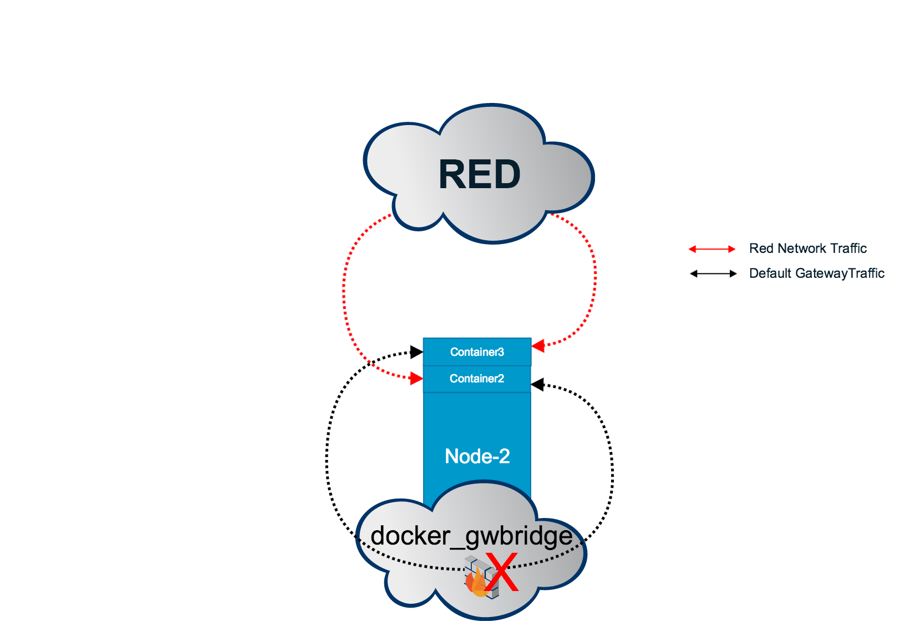
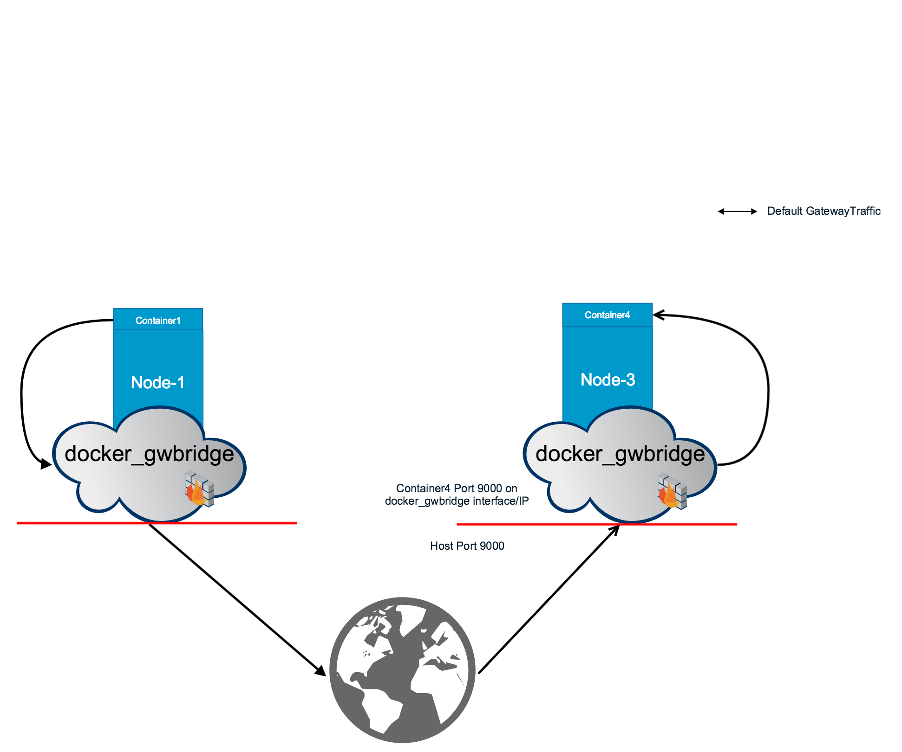

# Lab 06: Docker Networking

> **Difficulty**: Advanced

> **Time**: 30-40 minutes

> **Tasks**:
> 
- [Prerequisites](#prerequisites)
- [Task 1: Set up a key-value store](#task-1-set-up-a-key-value-store)
- [Task 2: Configure the engines to use key-value store](#task-2-configure-the-engine-to-use-key-value-store)
- [Task 3: Learn the default networks](#task-3-learn-the-default-networks)
- [Task 4. Create the "RED" overlay Network](#task-4-create-the-red-overlay-network)
- [Task 5: Run Containers on the RED network](#task-5-run-containers-on-the-red-network)
- [Task 6: Create the "BLUE" Overlay Network](#task-6-create-the-blue-overlay-network)
- [Task 7: Cross-Network Communication](#task-7-cross-network-communication)
- [Task 8: Reconnecting Containers](#task-8-reconnecting-containers)

# Note

Note: This tutorial was built using Docker v1.9. In v1.10, Docker uses DNS-based container discovery instead of `/etc/hosts`. If you're using 1.10, some outputs might differ from what is shown in this tutorial. Functionality should remain the same.

# Get started with multi-host networking

Before Docker 1.9, containers running on different hosts had to use the underlying host's TCP/IP stack to communicate among themselves. They did this by mapping a host TCP/UDP port to a container TCP/UDP port. This architecture was limiting and unscalable.

Docker 1.9 revamped networking and introduced a new native networking driver that enables multi-host networking. Multi-host networking makes possible communication among containers residing on separate hosts without relying on the hosts' TCP/IP stacks.

This lab illustrates the basics of creating a multi-host network. Docker Engine
supports this out-of-the-box through the `overlay` network.  Unlike `bridge`
networks, `overlay` networks require some pre-existing conditions before you can
create one. These conditions are:

* Access to a key-value store. Engine supports Consul, etcd, ZooKeeper (Distributed store), and BoltDB (Local store) as key-value stores.
* A cluster of hosts with connectivity to the key-value store.
* A properly configured Engine `daemon` on each host in the cluster.
* Underlying host network must allow the following TCP/UDP Ports:
	* Docker Engine port (e.g TCP 2375)
	* VXLAN: UDP 4789
	* Serf: TCP + UDP 7946
	* Key-value store ( e.g for Consul TCP 8500)
* The Docker host must be running at least version 3.16 or later of the Linux kernel

## Prerequisites

You will use all four nodes : `node-0`,`node-1`,`node-2`, and `node-3`.  On each node, do the following:

* Check for running containers with `docker ps` and stop any containers if they are running.
* Make sure the `DOCKER_OPTS` value in `/etc/default/docker` file is commented out like this:

			# Use DOCKER_OPTS to modify the daemon startup options.
			#DOCKER_OPTS="--dns 8.8.8.8 --dns 8.8.4.4"

	Commenting this line out ensures the `daemon` uses default settings.  If you had to comment this line out you will need to restart the docker daemon - `service docker restart`.

* In your shell, unset the `DOCKER_HOST` variable:

		$ unset DOCKER_HOST

Throughout this lab, you may be required to substitute the IP of an instance. AWS only allows certain TCP ports on the private AWS network. Therefore, make sure you use private IP addresses (10.X.X.X) when you substitute the IP of the instance.

Finally, some of the actions in this lab require `sudo`. Where `sudo` is required, the lab so indicates.

## Task 1: Set up a key-value store

An overlay network requires a key-value store. The store maintains information about the network state which includes discovery, networks, endpoints, IP Addresses, and more. The Docker Engine currently supports Consul, etcd, ZooKeeper (Distributed store), and BoltDB (Local store) key-value store stores. This example uses Consul.

1. SSH into `node-0`.

2. Start the Consul container.

		$ docker run -d -p 8500:8500 -h consul --name consul progrium/consul -server -bootstrap
		Unable to find image 'progrium/consul:latest' locally
		latest: Pulling from progrium/consul
		3b4d28ce80e4: Pull complete
		e5ab901dcf2d: Pull complete
		...content omitted...

3.  Ensure that the container is Up and listening to port 8500

			$ docker ps
			CONTAINER ID        IMAGE               COMMAND                  CREATED             STATUS              PORTS                                                                            NAMES
			3092b9afa96c        progrium/consul     "/bin/start -server -"   35 seconds ago      Up 34 seconds       53/tcp, 53/udp, 8300-8302/tcp, 8301-8302/udp, 8400/tcp, 0.0.0.0:8500->8500/tcp   consul
The diagram below shows **node-0** configured as the key-value store.

## Task 2: Configure the Engine to use key-value store

On `node-1`, `node-2`,and `node-3`, reconfigure the Docker daemon to listen on TCP port `2375` and to use the Consul key-value store created in Task 1.

1. SSH to `node-1`.

2. Edit the `/etc/default/docker` file with your favorite editor (`vi` and `nano` are both available).

		$ sudo vi /etc/default/docker

3. Add the following `DOCKER_OPTS`.

 	Make sure you provide the `Private IP` value for `node-0` where you started Consul.

		DOCKER_OPTS="-H tcp://0.0.0.0:2375 -H unix:///var/run/docker.sock --cluster-store=consul://<NODE-0-PRIVATE-IP>:8500/network --cluster-advertise=eth0:2375"

Note: node-0 has to be healthy and reachable by each of the node-1,2,3.

4. Save and close the file.

5. Restart the Docker Engine for these settings to take effect:

		$ sudo service docker restart
		docker stop/waiting
		docker start/running, process 2003

6. Ensure that each engine restarts successfully:

		$ docker ps
		CONTAINER ID        IMAGE               COMMAND             CREATED             STATUS              PORTS               NAMES

7. Repeat steps 2-6 on `node-2`.

8. Repeat steps 2-6 on `node-3`.

## Task 3: Learn the default networks

Before you create an overlay network, it is a good idea to understand the default networks that Docker creates. Go ahead and list the networks on any of your nodes.

	$ docker network ls
	NETWORK ID          NAME                DRIVER
	38ffb13fa56d        none                null
	34c7921e8cb7        host                host
	25b439c6c8ca        bridge              bridge   

Each Docker host has these default networks, only the IDs differ.

Historically, these three networks are part of Docker's implementation. When you run a container you can use the `--net` flag to specify which network you want to run the container on. These three networks are still available to you.

* The `bridge` network represents the `docker0` network present in all Docker installations. Unless you specify otherwise with the `docker run --net=<NETWORK>` option, the Docker daemon connects containers to this network by default.

* The `none` network adds a container to a container-specific network stack. That container lacks a network interface.

* The `host` network adds a container on the hosts network stack. You'll find the network configuration inside the container is identical to the host.

The new native `overlay` network driver supports multi-host networking natively out-of-the-box. This support is accomplished with the help of `libnetwork`, a built-in VXLAN-based overlay network driver, and Docker's `libkv` library.

## Task 4. Create the "RED" overlay Network

Now that your three nodes are configured to use the key-value store, you can create an overlay network on any node. When you create the network, it is distributed to all the nodes.

1. Pick one of you three nodes (node-1, node-2 or node-3) and log into that node.

2. Create an `overlay` network.

		$ docker network create -d overlay --subnet=10.10.10.0/24 RED

	This creates the `RED` network with the 10.10.10.0/24 subnet.

2.  Check that the network is running on your node.

		$ docker network ls
		NETWORK ID          NAME                DRIVER
		7b1cda01f47f        RED                 overlay
		38ffb13fa56d        none                null
		34c7921e8cb7        host                host
		25b439c6c8ca        bridge              bridge   

3.  Now, log into the remaining nodes and immediately list the networks.

		$ docker network ls
		NETWORK ID          NAME                DRIVER
		7b1cda01f47f        RED                 overlay
		1ae83a006465        host                host
		501f891883cf        bridge              bridge
		a141cc346b6c        none                null

	You'll find that all three nodes can see the `RED` network, and that unlike the default networks, `RED` has the same ID on all three hosts even though you created it on only one of them.

## Task 5: Run Containers on the RED network

Once your network is created, you can start a container on any of the hosts and it automatically is part of the network.

The following steps will create two containers and connect them both tot the RED network.

1. Log into `node-1`.

2. Run a simple `busybox` container named `container1`.

			$ docker run -itd --name container1 --net RED busybox
			

3. Log onto `node-2` and run a `busybox` container named `container2`.

			$ docker run -itd --name container2 --net RED busybox

4. Return to node-1, and use `docker network inspect` to inspect the RED network. The `inspect` command only shows info about containers running on the local Docker host.

		node-1$ docker network inspect RED
		[
		    {
		        "Name": "RED",
		        "Id": "6f5f9bad52a6ca306e54b70cdac4707eb89b251271f89bf4d79effab28d90795",
		        "Scope": "global",
		        "Driver": "overlay",
		        "IPAM": {
		            "Driver": "default",
		            "Config": [
		                {
		                    "Subnet": "10.10.10.0/24"
		                }
		            ]
		        },
		        "Containers": {
		            "e9f06a4898d0e67e0f3fff806c08e1738cfdfa9c15e47c7d9fd8fd7368d95515": {
		                "EndpointID": "9e12ef3fc3779e09ed33d12d4a8954afbbf86eaf31c8e4eace5aaedcfa64e359",
		                "MacAddress": "02:42:0a:0a:1e:02",
		                "IPv4Address": "10.10.10.2/24",
		                "IPv6Address": ""
		            }
		        },
		        "Options": {}
		    }
		]

5. Look at the `container1` network configuration.

		$ docker exec container1 ifconfig
		eth0      Link encap:Ethernet  HWaddr 02:42:0A:0A:0A:02
		          inet addr:10.10.10.2  Bcast:0.0.0.0  Mask:255.255.255.0
		          inet6 addr: fe80::42:aff:fe0a:a02/64 Scope:Link
		          UP BROADCAST RUNNING MULTICAST  MTU:1450  Metric:1
		          RX packets:13 errors:0 dropped:0 overruns:0 frame:0
		          TX packets:8 errors:0 dropped:0 overruns:0 carrier:0
		          collisions:0 txqueuelen:0
		          RX bytes:1038 (1.0 KiB)  TX bytes:648 (648.0 B)

		eth1      Link encap:Ethernet  HWaddr 02:42:AC:12:00:02
		          inet addr:172.18.0.2  Bcast:0.0.0.0  Mask:255.255.0.0
		          inet6 addr: fe80::42:acff:fe12:2/64 Scope:Link
		          UP BROADCAST RUNNING MULTICAST  MTU:1500  Metric:1
		          RX packets:14 errors:0 dropped:0 overruns:0 frame:0
		          TX packets:8 errors:0 dropped:0 overruns:0 carrier:0
		          collisions:0 txqueuelen:0
		          RX bytes:1128 (1.1 KiB)  TX bytes:648 (648.0 B)

		lo        Link encap:Local Loopback
		          inet addr:127.0.0.1  Mask:255.0.0.0
		          inet6 addr: ::1/128 Scope:Host
		          UP LOOPBACK RUNNING  MTU:65536  Metric:1
		          RX packets:0 errors:0 dropped:0 overruns:0 frame:0
		          TX packets:0 errors:0 dropped:0 overruns:0 carrier:0
		          collisions:0 txqueuelen:0
		          RX bytes:0 (0.0 B)  TX bytes:0 (0.0 B)

	You can see that `eth0` was assigned an IP from RED's `10.10.10.0/24` subnet. There is also an `eth1` interface with a `172.18.0.0/16` address. When you create your first overlay network on any host, Docker also creates another network on each host called `docker_gwbridge`. Docker uses this network to provide external access for containers.

	Every container in an overlay network gets an `eth` interface on the
	`docker_gwbridge` which allows the container to access the external world. The
	`docker_gwbridge` is similar to Docker's default `bridge` network, but unlike
	the `bridge` it restricts Inter-Container Communication(ICC). Docker creates
	only one `docker_gwbridge` bridge network per host regardless of the number of
	overlay networks present.

6.  Overlay networks also support a container discovery feature. Still on 
7.  `node-1` run the following command.

		$ docker exec container1 cat /etc/hosts
		10.10.10.2	42b58f7ea6dd
		127.0.0.1	localhost
		::1	localhost ip6-localhost ip6-loopback
		fe00::0	ip6-localnet
		ff00::0	ip6-mcastprefix
		ff02::1	ip6-allnodes
		ff02::2	ip6-allrouters
		10.10.10.3	container2
		10.10.10.3	container2.RED

	As you can see, Docker added an entry to `/etc/hosts` for each container that
	belongs to the `RED` overlay network. Therefore, to reach `container2` from
	`container1`, you can simply use its name. Docker automatically updates
	`/etc/hosts` when containers connect and disconnect from an overlay network.

7. Ping `container2` from `container1`.

		$ docker exec container1 ping -w 3 container2
		PING container2 (10.10.10.3): 56 data bytes
		64 bytes from 10.10.10.3: seq=0 ttl=64 time=1.221 ms
		64 bytes from 10.10.10.3: seq=1 ttl=64 time=1.106 ms
		64 bytes from 10.10.10.3: seq=2 ttl=64 time=1.042 ms

	All TCP/UDP ports are open on an overlay network. There is no need to do any host-port mapping to expose these ports to the other containers on the same network. Test a TCP connection between `container1` and `container2`.

8. Goto `node-2` and get the it's RED network IP address.

			$ docker exec container2 ifconfig | grep '10.10.10'
			inet addr:10.10.10.3  Bcast:0.0.0.0  Mask:255.255.255.0

9. Set `container2` to listen on port `9000` on that interface.

		 $ docker exec container2 nc -l 10.10.10.3:9000

10. Return to `node-1` and test the TCP connection.

			$ docker exec -it container1 nc container2 9000 &> /dev/null; echo $?
			0

	If the output is `0`, then you have successfully established a TCP connection on port `9000`.

## Task 6: Create the "BLUE" Overlay Network

1.  Create another `overlay` network called `BLUE` with the 10.10.20.0/24 subnet.

		$ docker network create -d overlay --subnet=10.10.20.0/24 BLUE

	As you know, you can create this on any node (1-3).

2. Verify the network was created.

		$ docker network ls
		NETWORK ID          NAME                DRIVER
		4f2bbdadc4a9        BLUE                overlay             
		a48323b9feea        RED                 overlay             
		16cdaa4f5c70        none                null                
		c8a3ec609d61        host                host                
		0d24ea92c876        bridge              bridge  

3.  Log into `node-2` and create `container3` on the `RED` network.

		$ docker run -itd --name container3 --net RED busybox
		81f1d923a406471f2a3abdd2c56e942079c27cf092d45d241291156bd033f15d

4. Connect `container3` to the `BLUE` network.

		$ docker network connect BLUE container3

5. Log into `node-3` and  create `container4` on the BLUE network.  

		$ docker run -itd --name container4 --net BLUE busybox

	At this point `container4` is on `node-3` and connected to the `BLUE` network.
	While `container3` is on `node-2` but connected to both the `RED` and `BLUE` networks. This way, `container3` is able to communicate to `container4` over the `BLUE` network and  to `container1` and `container2` over the `RED` network.

5. Go to `node-2` and observe that `container3` now has interfaces in both networks.

			$ docker exec container3 ifconfig

## Task 7: Cross-Network Communication

At this point, `container2` and `container3` can communicate over the `RED` overlay network. They are both on the same `docker_gwbridge` but they cannot communicate using that bridge network without host-port mapping. The `docker_gwbridge` is used for all other traffic.

While `container1` and `container4` are on separate overlay networks and by default can not communicate. If you need them to communicate, you can either put them on the same overlay network or map them to a host port.

If you map a host-port to the container port, the container's `docker_gwbridge` interface/IP address must be mapped to the host's IP/Port. Let's connect `container1` and `container4` using host-port mapping.

1. Go to `node-3` and remove `container4`.

 		$ docker rm -f container4

	You have to remove `container4` because you can't publish a port on a running container.

2. Now recreate `container4` but this time publish port `9000`.

 		$ docker run -it --name container4 --net BLUE -p 9000:9000 busybox nc -l 0.0.0.0:9000

3. Return to `node-1` and test port `9000`.

	Make sure you provide the `Private IP` value for `node-3` where you started `container4` (you can get this using the `ip a` command from the terminal of `node-3`).

		$ docker exec -it container1 nc <NODE_3_PRIVATE_IP> 9000 &> /dev/null; echo $?

	If the output is `0`, then you have successfully established a TCP connection on port `9000` using host-port mapping.

## Task 8: Reconnecting Containers

You can easily disconnect containers from any network and connect them to another. Try this now.

1. On node-2 disconnect `container2` from the `RED` network.

		$ docker network disconnect RED container2

2. Now attach `container2` to the `BLUE` network.

 		$ docker network connect BLUE container2

3. Observe that `container2` has an interface in `BLUE` network.

		$ docker exec container2 ifconfig

## Conclusion

Congrats! You have completed the tutorial!

In this tutorial you learned about the new networking features introduced in Docker 1.9. You created a two multi-host overlay network that spanned multiple Docker hosts. You also observed how inter-container networking works in different scenarios.

### Share on Twitter!

<a href="http://ctt.ec/4a7lc" target=“_blank”>

## Cleanup

If you plan to do another lab, you need to cleanup your EC2 instances. Cleanup removes any environment variables, configuration changes, Docker images, and running containers. To do a clean up,

1. Log into each EC2 instance you used and run the following:

		$ source /home/ubuntu/cleanup.sh

## Related information

* [Docker Multi-Host Networking overview](http://blog.docker.com/2015/11/docker-multi-host-networking-ga/)
